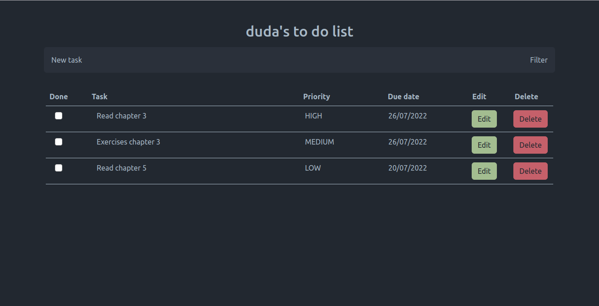

# to-do-list-app

This project is a result of my studies on **Rest API**, **Spring Boot** and **Angular**. It is an application for organizing tasks. The backend implementation creates a list of tasks as a table in a database and the frontend implementation allows the user to insert, filter, edit and delete tasks.

Please refer to [to-do-list_backend](https://github.com/dudamirandaa/to-do-list-app/tree/main/to-do-list_backend) and [to-do-list_frontend](https://github.com/dudamirandaa/to-do-list-app/tree/main/to-do-list_frontend) for more details.

---

### Images

Home page:

