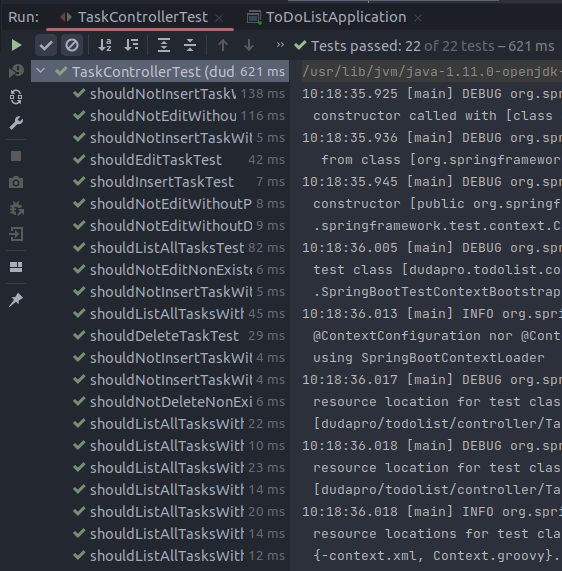
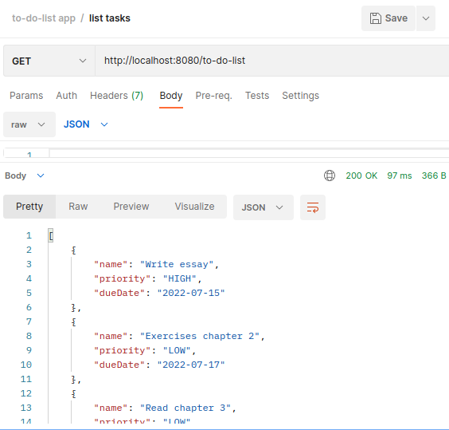
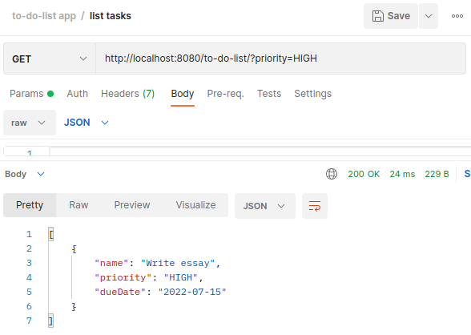
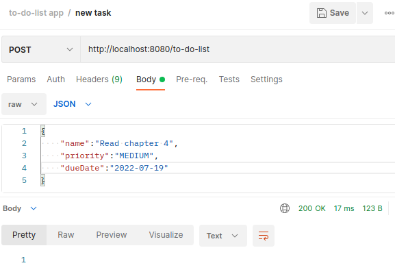
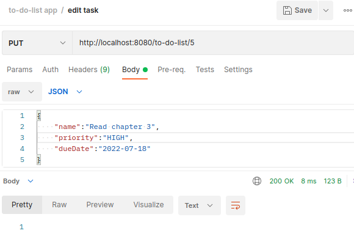
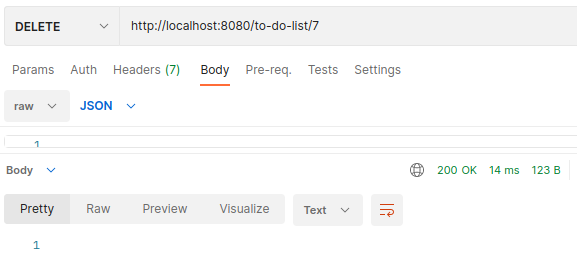
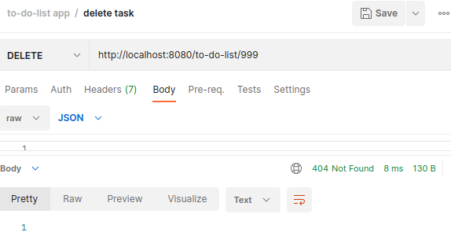

# To-do list app - REST API

This project was developed during the **Spring Boot API REST** course from Alura. The application creates a list of tasks as a table in a database.

This app was made using concepts of JpaRepository, Data Transfer Object, Dependency Injection, JpaSpecificationExecutor, ResponseEntity, Liquibase, JUnit unity tests, among others.

You can use Postman to execute the below:

- List all tasks;
- Filter tasks by name, priority or date;
- Insert new task;
- Edit task's name, priority or date;
- Delete task.

Thee application returns the 404 error in the case of trying to alter or delete a nonexistent item. 

Unit tests validate the below characteristics:

- Get:
  - List all tasks;
  - List all tasks filtering by name, priority, date, or combinations between the three.
- Post:
  - Add new task;
  - Not add new task if the priority input is invalid;
  - Not add new task if name, priotity or date are not input.
- Put:
  - Edit task;
  - Not edit task if name, priotity or date are not input;
  - Return 404 error if trying to alter a nonexistent item.
- Delete:
  - Delete task;
  - Return 404 error if trying to delete a nonexistent item.

---

### Images

Tests passsed:

List all tasks:

List tasks filtering by priority:

Insert new task:

Edit task's priority:

Delete task:

404 error when trying to delete a nonexistent item:

