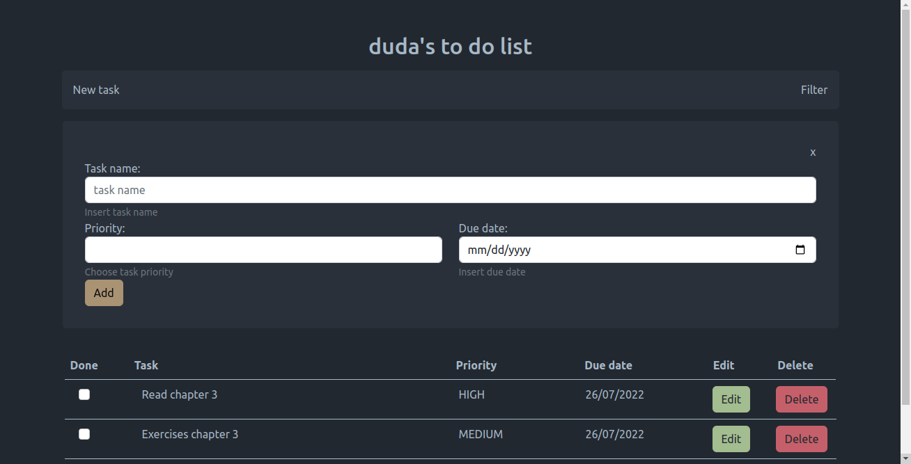

# To-do list app - Angular

This project was developed as a result of my studies on **Angular** courses from Alura. The application was crafted using concepts I learned including http request, API integrations, @Input and @Output annotations and event bindings.

In combination with the Rest API built for this app, you can use this interface to:

- List tasks;
- Filter tasks by name, priority or due date;
- Add new tasks;
- Edit name, priority or due dates of tasks;
- Delete tasks.

### Start

To start this application, please run the `npm run start` command.

---

### Imagens

Home page:

Add new task card:

Filter tasks card:

Edit task card:

This project was generated with [Angular CLI](https://github.com/angular/angular-cli) version 14.0.7.
